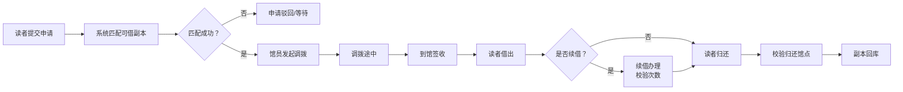
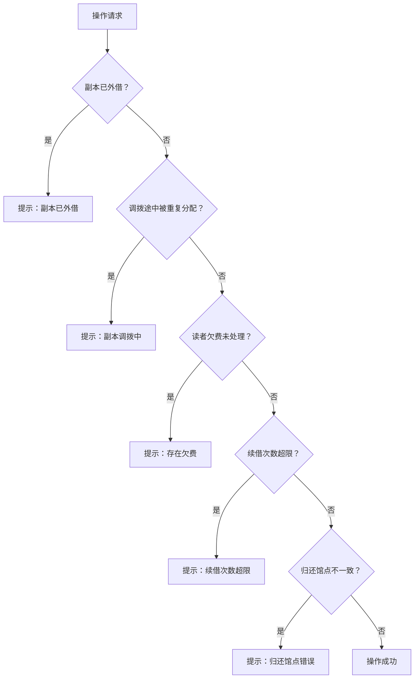

# 图书馆馆际互借与催还系统 PRD

## 1. 产品概述

图书馆馆际互借与催还系统，支持读者提交借阅需求后在多馆藏点间匹配可借副本，馆员可执行调拨、签收、借出和归还全流程操作。系统提供馆藏流转看板、逾期催还、读者档案和记录导出功能，确保借阅全流程可追溯、数据可持久化。

- 解决问题：多馆点图书共享与流转管理效率低、催还不及时、流转记录不完整
- 目标用户：图书馆馆员（管理员）、读者
- 核心价值：提升馆际互借效率，降低逾期率，实现全流程数字化管理

## 2. 核心功能

### 2.1 用户角色

| 角色 | 登录方式 | 核心权限 |
|------|----------|----------|
| 馆员（管理员） | 账号登录 | 全功能操作：调拨管理、借出归还、催还管理、数据导出、看板查看 |
| 读者 | 账号登录 | 提交借阅申请、续借、查询借阅状态、查看个人档案 |

### 2.2 功能模块

1. **馆藏流转看板**：实时展示各馆点馆藏数量、在途调拨、逾期状态总览
2. **借阅申请管理**：读者提交申请、系统智能匹配可借副本、申请状态跟踪
3. **调拨管理**：发起调拨、取消调拨（副本回库）、到馆签收、调拨流转记录
4. **借还管理**：图书借出、归还（馆点校验）、续借（次数限制）
5. **逾期催还**：逾期列表、催还记录、逾期状态自动刷新
6. **读者借阅档案**：读者信息、借阅历史、欠费记录、催还统计
7. **借阅记录导出**：导出CSV，包含催还次数、当前副本位置等完整信息
8. **数据持久化**：副本位置、申请状态、催还记录、导出历史重启可复查

### 2.3 页面详情

| 页面名称 | 模块名称 | 功能描述 |
|----------|----------|----------|
| 馆藏流转看板 | 数据概览卡片 | 总馆藏量、可借数量、调拨中、逾期数量统计卡片 |
| 馆藏流转看板 | 馆点库存分布 | 各馆点库存数量柱状展示、状态分类统计 |
| 馆藏流转看板 | 流转记录时间线 | 最近调拨/借还流转记录列表 |
| 借阅申请 | 申请列表 | 所有借阅申请列表，按状态筛选 |
| 借阅申请 | 新建申请 | 读者选择图书、提交借阅申请 |
| 借阅申请 | 申请详情 | 申请信息、匹配结果、操作按钮 |
| 调拨管理 | 调拨列表 | 所有调拨单列表，按状态筛选 |
| 调拨管理 | 发起调拨 | 从源馆点调拨到目标馆点 |
| 借还管理 | 借出登记 | 扫描/选择副本，登记借出给读者 |
| 借还管理 | 归还登记 | 扫描/选择副本，登记归还（校验归还馆点） |
| 借还管理 | 续借办理 | 办理续借，校验续借次数 |
| 逾期催还 | 逾期列表 | 所有逾期借阅记录，显示逾期天数 |
| 逾期催还 | 催还操作 | 发起催还，记录催还次数 |
| 读者档案 | 读者列表 | 所有读者列表，支持搜索 |
| 读者档案 | 读者详情 | 读者基本信息、借阅历史、欠费记录 |
| 记录导出 | 导出面板 | 选择导出条件，生成CSV文件 |
| 记录导出 | 导出历史 | 历史导出记录列表，可重新下载 |
| 系统设置 | 馆点管理 | 馆藏点增删改查 |
| 系统设置 | 图书管理 | 图书及副本管理 |

## 3. 核心流程

### 3.1 借阅主流程

读者提交借阅申请 → 系统在多馆藏点匹配可借副本 → 馆员发起调拨 → 目标馆点签收 → 读者到馆借出 → （可选续借）→ 读者归还 → 副本回库

### 3.2 异常校验流程

## 4. 用户界面设计

### 4.1 设计风格

- **主色调**：深邃藏蓝 (#1e3a5f) 搭配 暖金点缀 (#d4a853)，体现图书馆的知识厚重感
- **辅助色**：墨绿 (#2d5a4d) 表示成功/可借、赭红 (#8b4513) 表示逾期/警告
- **背景色**：象牙白 (#faf8f5) 主背景，浅灰 (#f0ede8) 卡片背景
- **按钮风格**：微圆角 (6px)、轻微阴影、悬停上浮效果，主按钮为藏蓝配金色描边
- **字体**：标题使用 Lora（衬线字体，学术感），正文使用 Noto Sans SC（清晰易读）
- **布局风格**：左右分栏导航 + 卡片式内容区，顶部状态栏显示关键指标
- **装饰元素**：细金线分隔、羊皮纸纹理背景、书脊装饰图标

### 4.2 页面设计概览

| 页面名称 | 模块名称 | UI 元素 |
|----------|----------|---------|
| 馆藏流转看板 | 数据概览 | 4张统计卡片，金色数字，微动效，悬停轻微放大 |
| 馆藏流转看板 | 馆点分布 | 横向条形图，不同颜色标识状态，进度条动画 |
| 馆藏流转看板 | 流转时间线 | 左侧竖线时间轴，圆点标记节点，渐入动画 |
| 借阅申请列表 | 列表区 | 表格布局，行悬停高亮，状态标签彩色圆角 |
| 申请详情页 | 详情卡片 | 左右两栏布局，左侧申请信息，右侧操作区 |
| 调拨管理 | 调拨列表 | 卡片式列表，显示起止馆点、状态、时间 |
| 逾期催还 | 逾期列表 | 红色强调逾期天数，催还按钮醒目，次数徽章 |
| 读者档案 | 读者详情 | 头像+基本信息卡片，下方Tab切换借阅历史/欠费记录 |
| 记录导出 | 导出面板 | 表单式筛选条件，导出进度条，历史记录列表 |

### 4.3 响应式

- 桌面端优先设计 (1280px+)
- 平板端 (768px-1279px)：侧边栏折叠为图标导航
- 移动端 (<768px)：底部Tab导航，卡片单列布局，表格横向滚动
- 触摸优化：按钮最小尺寸 44px，列表项点击区域适当放大

### 4.4 动画与交互

- 页面加载：卡片渐入 + 轻微上浮，错开延迟 (staggered reveal)
- 状态变化：数字滚动动画 (count-up)，进度条平滑过渡
- 操作反馈：按钮点击波纹效果，成功/失败 Toast 提示
- 导航切换：内容区淡入淡出，侧边栏平滑展开收起
- 时间线：滚动触发渐入动画
