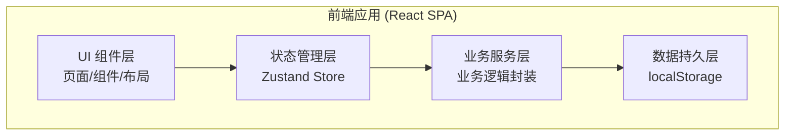
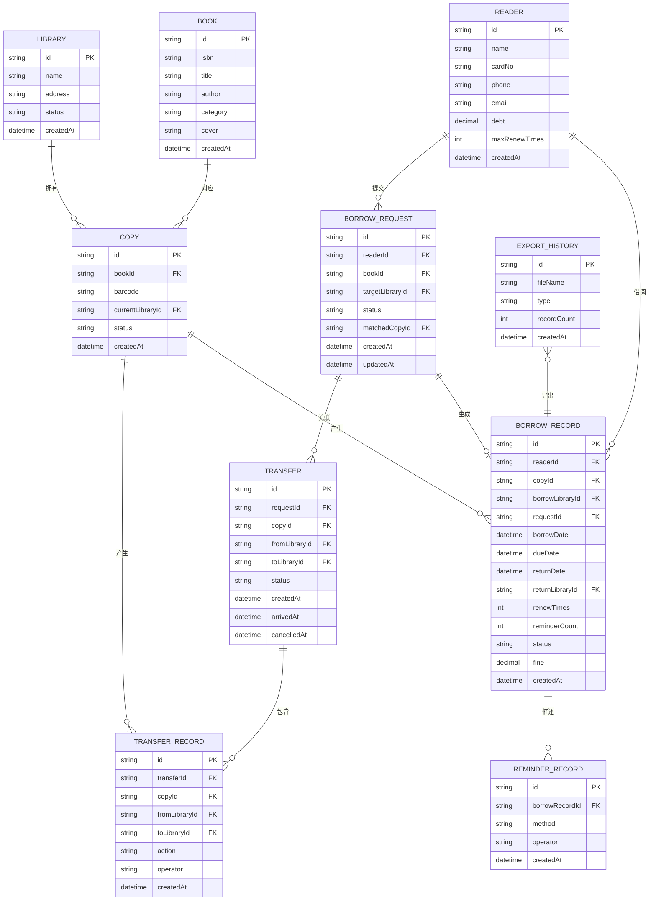

# 图书馆馆际互借与催还系统 技术架构文档

## 1. 架构设计



## 2. 技术描述

- **前端框架**：React@18 + TypeScript
- **构建工具**：Vite@5
- **样式方案**：TailwindCSS@3
- **状态管理**：Zustand
- **路由管理**：React Router v6
- **图标库**：Lucide React
- **数据持久化**：localStorage（封装持久化中间件）
- **日期处理**：date-fns
- **CSV 导出**：原生 Blob + URL.createObjectURL

### 技术选型说明

1. **React + TypeScript**：保证类型安全，便于维护复杂业务逻辑
2. **Zustand**：轻量级状态管理，支持中间件（persist）实现数据持久化
3. **localStorage**：无需后端服务，数据本地持久化，重启后数据可复查
4. **TailwindCSS**：快速构建一致的 UI，响应式设计友好
5. **Lucide React**：轻量、美观的图标库，符合图书馆系统的简约风格

## 3. 路由定义

| 路由路径 | 页面名称 | 权限 | 说明 |
|----------|----------|------|------|
| `/` | 馆藏流转看板 | 全员 | 系统首页，数据概览 |
| `/requests` | 借阅申请列表 | 全员 | 所有借阅申请 |
| `/requests/new` | 新建借阅申请 | 读者 | 提交新的借阅申请 |
| `/requests/:id` | 申请详情 | 全员 | 申请详情与操作 |
| `/transfers` | 调拨管理 | 馆员 | 调拨单列表与操作 |
| `/borrow` | 借还管理 | 馆员 | 借出、归还、续借 |
| `/overdue` | 逾期催还 | 馆员 | 逾期列表与催还操作 |
| `/readers` | 读者档案 | 馆员 | 读者列表 |
| `/readers/:id` | 读者详情 | 全员 | 读者借阅档案 |
| `/export` | 记录导出 | 馆员 | 导出面板与历史 |
| `/settings` | 系统设置 | 馆员 | 馆点、图书管理 |
| `/login` | 登录页 | - | 角色切换登录 |

## 4. 数据模型

### 4.1 ER 图



### 4.2 核心状态枚举

```typescript
// 副本状态
type CopyStatus = 'available' | 'borrowed' | 'transferring' | 'lost' | 'damaged';

// 借阅申请状态
type RequestStatus = 'pending' | 'matched' | 'transferring' | 'arrived' | 'borrowed' | 'completed' | 'cancelled' | 'rejected';

// 调拨状态
type TransferStatus = 'pending' | 'in_transit' | 'arrived' | 'cancelled';

// 借阅记录状态
type BorrowStatus = 'borrowed' | 'returned' | 'overdue' | 'renewed' | 'lost';
```

### 4.3 常量配置

```typescript
// 借阅期限（天）
const BORROW_PERIOD_DAYS = 30;

// 最大续借次数
const MAX_RENEW_TIMES = 2;

// 续借延长天数
const RENEW_EXTEND_DAYS = 30;

// 逾期罚款（元/天）
const OVERDUE_FINE_PER_DAY = 0.5;
```

## 5. 状态管理设计

### 5.1 Store 划分

| Store 名称 | 职责 |
|-----------|------|
| `authStore` | 用户登录、角色切换、当前用户 |
| `libraryStore` | 馆点数据管理 |
| `bookStore` | 图书与副本数据管理 |
| `readerStore` | 读者数据管理 |
| `requestStore` | 借阅申请管理、匹配逻辑 |
| `transferStore` | 调拨管理、流转记录 |
| `borrowStore` | 借还管理、续借、催还 |
| `exportStore` | 导出记录管理 |

### 5.2 持久化策略

所有业务数据 Store 均使用 zustand persist 中间件，存储到 localStorage，确保重启后数据可复查。

## 6. 核心业务逻辑

### 6.1 可借副本匹配算法

```
输入：图书ID、目标馆点ID
输出：匹配的副本ID 或 null

流程：
1. 获取该图书所有副本
2. 按优先级筛选：
   a. 目标馆点内状态为 available 的副本（优先使用本馆）
   b. 其他馆点状态为 available 的副本（按馆点距离/优先级排序）
3. 排除已被其他申请占用的副本（状态为 matched/transferring）
4. 返回第一个匹配的副本
```

### 6.2 逾期自动刷新机制

- 每次进入系统/页面时触发逾期检查
- 比较当前日期与应还日期，自动更新借阅记录状态为 overdue
- 计算逾期天数与罚款金额

### 6.3 取消调拨回库逻辑

```
输入：调拨单ID
流程：
1. 校验调拨单状态为 in_transit/pending
2. 更新调拨单状态为 cancelled
3. 更新副本位置回源馆点
4. 更新副本状态为 available
5. 关联的借阅申请状态更新为 pending（重新匹配）
6. 记录流转记录
```

## 7. 项目目录结构

```
src/
├── assets/          # 静态资源
├── components/      # 通用组件
│   ├── Layout/      # 布局组件
│   ├── StatusBadge/ # 状态标签
│   ├── Modal/       # 弹窗组件
│   └── Table/       # 表格组件
├── pages/           # 页面组件
│   ├── Dashboard/   # 馆藏流转看板
│   ├── Requests/    # 借阅申请
│   ├── Transfers/   # 调拨管理
│   ├── Borrow/      # 借还管理
│   ├── Overdue/     # 逾期催还
│   ├── Readers/     # 读者档案
│   ├── Export/      # 记录导出
│   └── Settings/    # 系统设置
├── stores/          # Zustand stores
├── services/        # 业务服务层
├── types/           # TypeScript 类型定义
├── utils/           # 工具函数
│   ├── date.ts      # 日期处理
│   ├── csv.ts       # CSV 导出
│   └── id.ts        # ID 生成
├── constants/       # 常量配置
├── App.tsx          # 根组件
├── main.tsx         # 入口文件
└── index.css        # 全局样式
```
